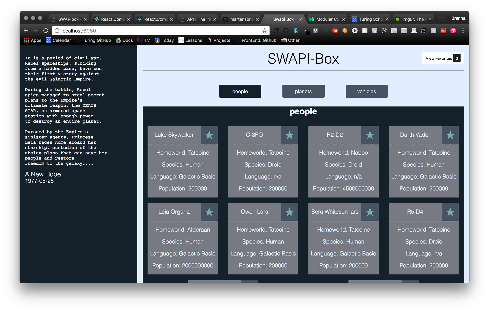
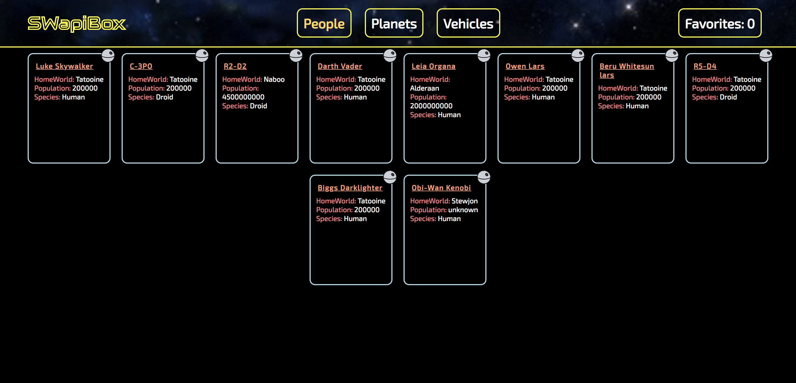

# SWapiBox

The goal of this project was pull data from an API, and using React and React Router, display the data to the page. Each data set was then displayed as cards on the page. Using Jest and Enzyme, a test suite was built for the application. This project was built using the [create-react-app](https://github.com/facebookincubator/create-react-app) boilerplate.

### Project team:

Chase Richard [GitHub](https://github.com/hmmChase) 

### Original comp:

  

### Our design:

## Set Up

* Clone this project

* Run `npm install` from the root directory

* Run `npm start` and visit localhost:3000 in your browser

* Run tests with `npm test`
